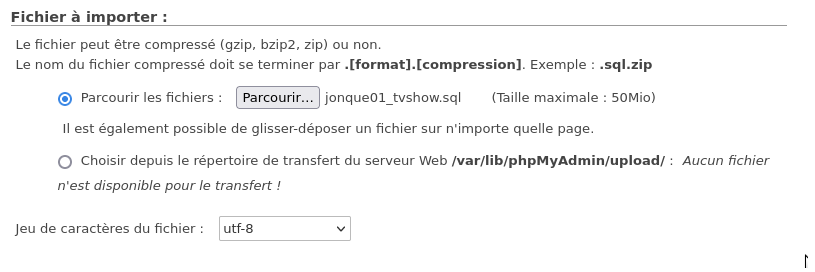

# Présentation

Voici le dépot git pour la SAE201 `php-crud-tvshow` par
Elias Richarme (rich0190) et Valentin Fortier (fort0050).

# Installation

Pour garantir le bon fonctionnement de notre projet,
Composer doit être installé sur votre machine. Il peut
être installé facilement avec [ce tutoriel](http://cutrona/installation-configuration/composer/) de Jérôme Cutrona.


Clonez le dépôt avec :
```bash
git clone https://iut-info.univ-reims.fr/gitlab/rich0190/php-crud-tvshow.git
```

Et, installez les extensions nécessaires avec :
```bash
composer install
```

Si vous avez une version de PHP différente de la notre (v8.1.29),
vous devrez ajuster les versions des extensions pour qu'elles
corespondent à votre version de PHP :
```bash
composer update 
```

Le projet est maintenant opérationnel, Le serveur local peut être
exécuté sur Windows ou linux via ces scripts  :
```bash
composer start:windows
```
```bash
composer start:linux
#ou
composer start
```

# PHP CS Fixer

Pour homogénéiser notre code source, nous suivons la
recommandation [PSR-12](https://www.php-fig.org/psr/psr-12/)
en utilisant PHP CS Fixer, un outil permettant de détecter
et corriger les erreurs de codage.

Pour détecter les problèmes :
```bash
composer test:cs
```

Pour les corriger :
```bash
composer fix:cs
```

# Init BD

Avant de commencer les classes et pages nous devons créer la base de données


Ensuite nous importons la base de données dans notre base



# Fonctionnement

Notre projet consiste en le listage de séries télévisées, de leurs saisons
respectives ainsi que les différents épisodes de ces saisons. Nous utilisons
pour cela une base de données dédiée où toutes les informations utiles à notre
projet y sont répertoriées.

Pout traiter ces informations, Nous créons une classe dédiée par élément de
la base de donnée, nous avons donc une classe pour les TvShow, les Season,
les Episode, les Poster (de serie et de saison) et les Genres possibles pour les séries.

Pour pouvoir lister nos données dans différentes pages, nous avons besoin de classes Collection.
Par exemple, la classe TvShowCollection qui récupère toutes les séries de la base de donnée et
crée des instance de TvShow, ou encore EpisodeCollection qui récupère tous les épisodes
d'une saison (à partir de l'identifiant de saison).

Pour la structuration de nos pages web, nous utilisons une classe WebPage permettant 
l'utilisation de nombreuses fonctionnalités pour faciliter le développement HTML. Couplée à 
la classe AppWebPage, nous pouvons implémenter un menu intéractif très simplement.

Concernant ce menu interactif, nous avons fait en sorte qu'il permette 